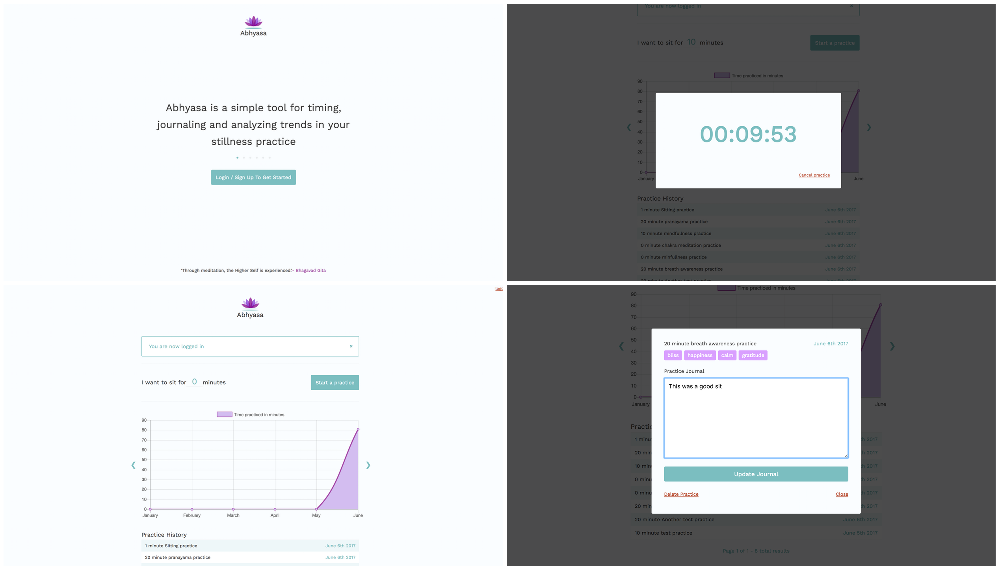

<h1>Abhyasa</h1>
<p><a href="https://nameless-castle-44080.herokuapp.com/">Abhyasa</a> is a responsive full stack application that helps users to time, log and track trends in thier stillness practice.</p>



## Getting started
### Installing
```
>   git clone https://github.com/martinseanhunt/Abhyasa.git
>   cd Abhyasa
>   npm install
```
### Launching
```
>   npm start
```
Open [`localhost:8080`]
### Testing
```
>   npm run test
```

<h2>Technology Used</h2>

<h3>Front End</h3>
<ul>
  <li>HTML5</li>
  <li>CSS3 (Mobile first responsive design)</li>
  <li>JavaScript</li>
  <li>jQuery</li>
  <li><a href="https://meyerweb.com/eric/tools/css/reset/">Reset CSS</a></li>
  <li><a href="https://fonts.googleapis.com">Google Fonts</a></li>
</ul>

<h3>Back End</h3>
<ul>
  <li>Node JS &amp; Express server</li>
  <li>MongoDB &amp; Mongoose database</li>
  <li>Mocha, Chai &amp; Sinon testing</li>
  <li>Travis CI &amp; Heroku deployment</li>
  <li>Passport JS user management</li>
  <li>Moment JS for working with dates</li>
</ul>